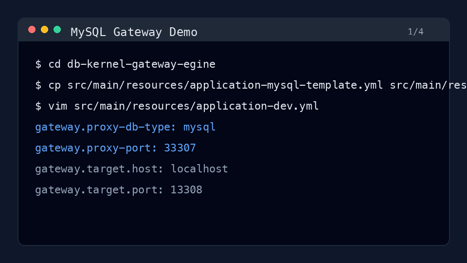
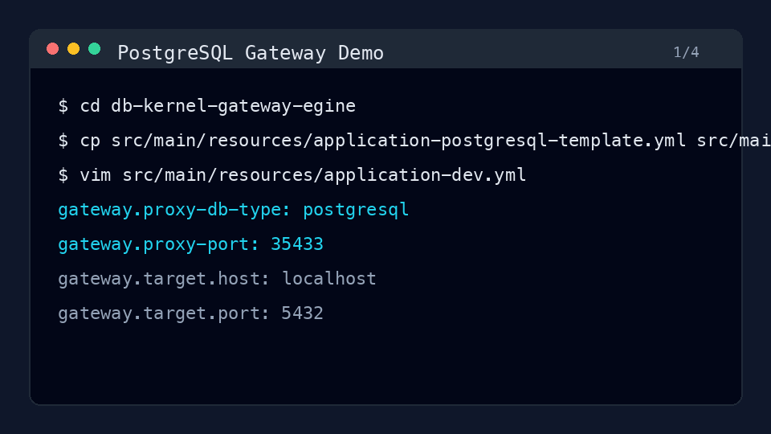

# 数据库内核网关引擎

一个基于 Java 17 和 Spring Boot 的数据库协议网关。客户端连接网关端口，网关把
MySQL 或 PostgreSQL wire protocol 流量透明转发到真实数据库，同时为后续 SQL 审计、
风控和观测能力预留协议层扩展点。

## 当前能力

- 支持 MySQL、PostgreSQL 透明代理转发。
- 由目标数据库完成真实认证，网关不保存也不校验明文密码。
- 可观察明文 SQL 流量，用于后续 SQL 记录和风控。
- TLS、压缩等不可明文解析的链路按 opaque tunnel 处理，优先保证转发正确性。

## 环境要求

- JDK 17+
- Maven 3.6+
- 本地或远端 MySQL / PostgreSQL
- 可选：`mysql` 或 `psql` 命令行客户端，用于手工验证代理链路

## 配置说明

通用默认配置在：

```text
src/main/resources/application.yml
```

本地开发配置建议放在：

```text
src/main/resources/application-dev.yml
```

`application-dev.yml` 已在 `.gitignore` 中忽略，适合放本机数据库地址和密码。

端口含义：

- `server.port`：Spring Boot HTTP 端口，用于 Web/Actuator 等入口。
- `gateway.proxy-port`：数据库协议代理端口，数据库客户端连接这个端口。
- `gateway.target.port`：真实后端数据库端口。

## MySQL 网关

复制 MySQL 配置模板：

```bash
cp src/main/resources/application-mysql-template.yml src/main/resources/application-dev.yml
```

按本地 MySQL 信息修改 `application-dev.yml`：

```yaml
server:
  port: 8080

gateway:
  proxy-db-type: mysql
  proxy-port: 33307
  target:
    host: localhost
    port: 13308
    username: root
    password: change-me
    database: mysql
```

启动服务：

```bash
mvn spring-boot:run -Dspring-boot.run.profiles=dev
```

启动成功后会看到类似日志：

```text
Starting MySQL protocol adapter on port 33307
MySQL protocol adapter started successfully
```

另开一个终端，通过网关端口连接：

```bash
mysql --protocol=tcp -h 127.0.0.1 -P 33307 -uroot -p
```

进入 MySQL 后执行：

```sql
select 1;
```

能正常返回结果，说明链路已经打通：

```text
mysql client -> gateway:33307 -> target mysql:13308
```

效果示意：



## PostgreSQL 网关

复制 PostgreSQL 配置模板：

```bash
cp src/main/resources/application-postgresql-template.yml src/main/resources/application-dev.yml
```

按本地 PostgreSQL 信息修改 `application-dev.yml`：

```yaml
server:
  port: 8080

gateway:
  proxy-db-type: postgresql
  proxy-port: 35433
  target:
    host: localhost
    port: 5432
    username: postgres
    password: change-me
    database: postgres
```

启动服务：

```bash
mvn spring-boot:run -Dspring-boot.run.profiles=dev
```

启动成功后会看到类似日志：

```text
Starting POSTGRESQL protocol adapter on port 35433
PostgreSQL protocol adapter started successfully
```

另开一个终端，通过网关端口连接：

```bash
psql -h 127.0.0.1 -p 35433 -U postgres -d postgres
```

进入 PostgreSQL 后执行：

```sql
select 1;
```

能正常返回结果，说明链路已经打通：

```text
psql client -> gateway:35433 -> target postgresql:5432
```

效果示意：



## 测试

运行单元测试：

```bash
mvn test
```

运行真实数据库集成测试：

```bash
mvn -Pintegration-test test
```

集成测试的本地连接信息放在：

```text
src/test/resources/integration-test-local.properties
```

该文件同样已被忽略，不应提交真实密码。

## 开发约定

- MySQL 协议代码放在 `com.whosly.gateway.adapter.mysql`。
- PostgreSQL 协议代码放在 `com.whosly.gateway.adapter.postgresql`。
- 共享协议抽象放在 `com.whosly.gateway.adapter.protocol`。
- 不支持的协议必须快速失败，不能临时映射到其他协议适配器。
- 不要记录明文密码、认证 payload 或带凭据的连接串。
