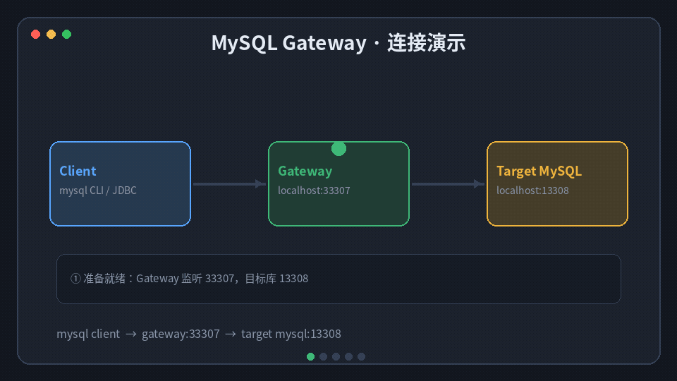
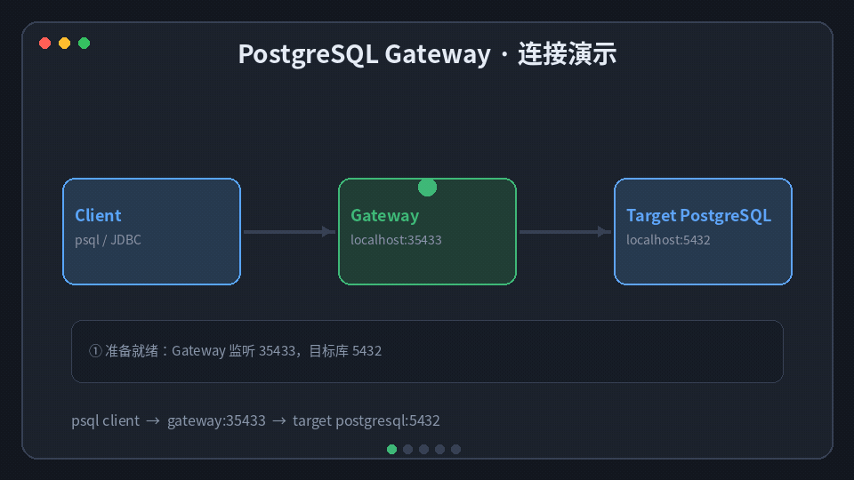

# 数据库内核网关引擎

基于 **Java 17** 的透明数据库协议网关：客户端连网关端口，网关把 **MySQL / PostgreSQL** wire 流量转发到真实目标库，并在**明文阶段**提供 SQL 观测、可选审计留痕与结果集脱敏等扩展点。第三协议 **SQL Server（TDS）** 处于 **P0 脚手架 / 透明中继**（见 [`docs/SQLSERVER_TDS_PLAN.md`](docs/SQLSERVER_TDS_PLAN.md)），**不是**完整观测/脱敏实现。

> 网关不伪造握手能力、不校验也不保存客户端明文密码；认证与结果由目标库完成。  
> 能力边界以本 README「功能清单」与 [`docs/STATUS_AND_GAPS.md`](docs/STATUS_AND_GAPS.md) 为准——规划中的能力不会写成「已实现」。

## 目录

- [分支与验证基线](#分支与验证基线)
- [功能清单](#功能清单)
- [端口速查](#端口速查)
- [环境要求](#环境要求)
- [配置说明](#配置说明)
- [快速开始 · MySQL](#快速开始--mysql)
- [快速开始 · PostgreSQL](#快速开始--postgresql)
- [快速开始 · SQL Server（P0）](#快速开始--sql-serverp0)
- [构建与测试](#构建与测试)
- [演示](#演示)
- [审计与脱敏](#审计与脱敏)
- [数据库管控台](#数据库管控台)
- [文档索引](#文档索引)
- [开发约定](#开发约定)

## 分支与验证基线

| 项 | 本分支（`future/database-wire-protocol-foundation`） |
|---|---|
| 默认单元测试 | **436** 条全绿（JDK 17；`pom` 排除 `*IntegrationTest`；以 STATUS §1 为准） |
| 真库集成 `-Pintegration-test` | **14 / 14** 全绿（2026-09-24，本地 Docker MySQL `:13308` + PostgreSQL `:5432`） |
| JDK / 编译 | `pom` 目标 **17**；虚拟线程经 `VirtualThreadExecutors` **反射**在 JDK 21+ 启用，JDK 17 回退平台线程池（STATUS P0-1） |
| 核心数据路径 | 透明代理、查询/结果、预处理、错误透传、脱敏 happy path、PG `COPY` — **已在集成中 live-proven** |

详细缺口与证据表：**[`docs/STATUS_AND_GAPS.md`](docs/STATUS_AND_GAPS.md)**。

## 功能清单

状态约定（与 STATUS 对齐，措辞面向使用者）：

| 标记 | 含义 |
|---|---|
| **已实现** | 代码已接线，默认可用或默认路径已验证 |
| **已接线·默认关** | 实现齐全，需显式配置才启用 |
| **部分** | 有实现，但产品边界/类型覆盖/验收测试不完整 |
| **未实现** | 本分支无可用实现 |

完整协议枚举见 [`docs/PROTOCOL_REFERENCE_TABLES.md`](docs/PROTOCOL_REFERENCE_TABLES.md)。

| 能力 | 状态 | 说明 |
|---|---|---|
| MySQL / PostgreSQL 透明代理 | **已实现** | 真实认证在目标库；网关不保存、不校验、不记录明文密码；集成 live-proven |
| 查询 / 结果转发 | **已实现** | 含大结果集、多语句（MySQL）、事务；集成 live-proven |
| 预处理语句转发 | **已实现** | MySQL / PG prepared 路径集成 live-proven |
| 目标错误透传 | **已实现** | 目标库错误原样转发；集成 live-proven |
| 网关自身错误 → 协议原生包 | **已实现** | 如目标不可达：MySQL `1042/08S01`，PG `08006` |
| 明文 SQL 观测 | **已实现** | MySQL `COM_QUERY` / `COM_STMT_PREPARE`；PG `Query` / `Parse` / `Bind` / `Execute` 等 |
| 协议状态机 + 置信度 | **已实现** | 连接→协商→认证→就绪→执行→流式→关闭；`CONFIRMED` / `UNCERTAIN` / `SUSPENDED` |
| 大包重组 / 流式识别 | **已实现** | MySQL 大包；`LOAD DATA LOCAL` / PG `COPY` 期间不解析命令 |
| PG `COPY` 流转发 | **已实现** | 集成 live-proven |
| 结果集脱敏（happy path） | **已接线·默认关** | 无 `MaskingRule` 时逐字节透明；有规则时 fail-closed 改写；文本/常见二进制 happy path 集成 live-proven |
| 结果集脱敏（类型边界） | **部分** | decimal/时间/`geometry`/未知类型等非空改写常拒绝；MySQL `bit` 与 PG 整数/bool/浮点二进制可改写；见 STATUS §4.2 |
| 审计 spool / JDBC 搬运 | **已接线·默认关** | fail-closed；P0-3 专用单测已补；真库 JDBC 验收仍属集成 |
| 连接上限 / CIDR / idle | **已实现** | `max-connections`、`allowed-client-cidrs`、`idle-timeout-seconds` |
| 后端 failover / 路由 | **部分** | `backend-endpoints` 顺序 failover；可选 `gateway.routing.*` 按库名/用户/权重（默认关；协议无关） |
| PG Cancel | **部分** | `CancelRequest` 与 `BackendKeyData` **仅关联索引**；**不代发** cancel；MySQL `COM_PROCESS_KILL` 透传 |
| 风控策略 | **部分** | `DenyListDatabaseRiskPolicy` 可配置拒绝清单；空配置默认 `allowAll()` |
| TLS / 压缩 | **部分** | 默认 opaque / 可选拒绝；**可选 TLS 终止**（`gateway.tls.*`，协议无关）；压缩后仍 opaque |
| NIO 事件驱动 | **未实现** | 阻塞 socket + 每连接线程（可选虚拟线程） |
| 连接池化 | **已接线·默认关** | `gateway.pool.enabled`；`reset-mode=none\|protocol`；protocol=MySQL `COM_RESET_CONNECTION` / PG `DISCARD ALL` |
| Actuator / HTTP 指标出口 | **已接线·内存计数** | `/gateway/metrics` + `/actuator/gateway`；无远程 Micrometer |
| 非交互启动 | **已实现** | `Application` 自动 start；`gateway.cli.interactive` 默认 false |
| SQL Server（TDS）透明中继 | **部分（P0 脚手架）** | `SqlServerProtocolAdapter` 注册 `sqlserver`/`mssql`；双工字节转发 + TDS framing 单测；**无** Login7 观测 / 脱敏 / 协议 reset / 真库集成证明。计划：[`docs/SQLSERVER_TDS_PLAN.md`](docs/SQLSERVER_TDS_PLAN.md) |
| Oracle | **未实现** | stub：`gateway.proxy-db-type=oracle` 启动失败并提示 |

> 主流代理在数据平面上也不靠「跨线程共享可变协议状态」保证正确——本仓库同样让每条连接的协议状态在任一时刻只属于一个执行体。

### 结果集脱敏边界（摘要）

- **一列一规则**；未命中列保持原值；元数据不全或无法表示改写值 → **拒绝结果集**。
- MySQL：文本行 + 预处理二进制行（长度前缀类型、常见整数/浮点、`bit`）；`decimal`/时间/`geometry`/未知类型的非空改写拒绝。
- PostgreSQL：文本格式 + 可复现二进制（`text`/`bytea`/`json(b)`、`int2/4/8`、`bool`、`float4/8`）；`numeric`/时间/`uuid`/未知 OID 的非空改写拒绝；置 NULL 对任意类型可用。
- `NullingRule` **只匹配可空列**：MySQL 字面量列常为 `NOT NULL`，置 NULL 规则不会生效——需固定值/哈希/加密等。

细节以代码为准；排期缺口见 STATUS（P1-5）。


## 扩展新数据库（P2-7）

1. 实现 `ProtocolAdapter`（通常继承 `AbstractProtocolAdapter`）与 framing/session。
2. （可选）实现 `BackendSessionReset` 做池化 wire reset。
3. `ProtocolAdapterRegistry.register("mydb", MyDbAdapter::new, MyDbReset::new)`（或仅 adapter）。
4. 设置 `gateway.proxy-db-type=mydb`。池/TLS/路由等治理由基类继承，无需改 `PooledBackendProvider` / `RoutingBackendProvider`。
5. 身份感知路由：在 `acquire` 前填充 `RoutingContext`（database/username）；未填充时走默认 failover 列表。

内置：`mysql`、`postgresql`（别名 `postgres`）、`sqlserver`（别名 `mssql`，**P0 透明中继**）。预留 stub：`oracle` — 选择后启动失败并提示未实现。SQL Server 阶段见 [`docs/SQLSERVER_TDS_PLAN.md`](docs/SQLSERVER_TDS_PLAN.md)。

### 启用协议 reset

```yaml
gateway:
  pool:
    enabled: true
    reset-mode: protocol   # 默认 none（仅 close-if-unsafe）
```

### 启用按库/用户路由（P1-4）

```yaml
gateway:
  backend-endpoints: host1:3306,host2:3306   # 默认/未命中时的 failover
  routing:
    enabled: true
    rules:
      - match-database: app_a
        endpoints: hostA:3306,hostA2:3306:2   # 可选 :weight
      - match-username: readonly
        endpoints: hostR:3306
```

组合顺序：**Routing → Pool → Failover/Fixed**。`routing.enabled=false`（默认）时行为与仅 failover 相同。Oracle / SQL Server 适配器填充同一 `RoutingContext` 即可复用。


## 端口速查

| 协议 | `proxy-db-type` | 网关监听（客户端连） | 目标库（示例） | 模板 |
|---|---|---|---|---|
| MySQL | `mysql` | **33307** | 13308（lab Docker）/ 3306 | `application-mysql-template.yml` |
| PostgreSQL | `postgresql` / `postgres` | **35433** | 5432 | `application-postgresql-template.yml` |
| SQL Server（TDS） | `sqlserver` / `mssql` | **31433** | 1433 | `application-sqlserver-template.yml` |

共享治理（任意 `proxy-db-type`）：`gateway.pool.*`、`gateway.tls.*`、`gateway.routing.*`、`gateway.risk.*`、`gateway.audit.*` — 状态见上方功能清单与 STATUS。

## 环境要求

- JDK 17+（编译目标 17；JDK 21+ 运行时可选用虚拟线程）
- Maven 3.6+
- 本地或远端 MySQL / PostgreSQL（集成示例端口：MySQL **13308**、PostgreSQL **5432**）；SQL Server 目标 **1433**（P0 可选，无默认集成）
- 可选：`mysql` / `psql` / SQL Server 客户端（如 `sqlcmd`、JDBC）做手工验证

## 配置说明

| 文件 | 用途 |
|---|---|
| `src/main/resources/application.yml` | 通用默认（嵌套 `gateway.target.*`，与 `GatewayConfig` 对齐） |
| `src/main/resources/application-dev.yml` | 本地开发（已 gitignore） |
| `application-mysql-template.yml` / `application-postgresql-template.yml` / `application-sqlserver-template.yml` | 推荐复制为 `application-dev.yml` 的模板 |

**以 `GatewayConfig` 的 `@Value` 为准**：默认 `application.yml` 与模板均使用嵌套键 `gateway.target.*` 和 `gateway.idle-timeout-seconds`（P0-2 已对齐）。本地开发仍建议复制模板为 `application-dev.yml`。详见 [`docs/STATUS_AND_GAPS.md`](docs/STATUS_AND_GAPS.md) §3。

| 键 | 含义 |
|---|---|
| `server.port` | Spring HTTP（Web / 预留管控） |
| `gateway.proxy-port` | 数据库协议代理端口（客户端连这里） |
| `gateway.proxy-db-type` | `mysql` \| `postgresql` \| `sqlserver`/`mssql`（经 registry）；`oracle` stub |
| `gateway.target.host` / `port` / `username` / `password` / `database` | 主后端（**嵌套**） |
| `gateway.backend-endpoints` | 可选 `host:port,host:port` failover |
| `gateway.routing.enabled` / `rules` | 可选按库名/用户/权重路由（默认关） |
| `gateway.max-connections` | 并发连接上限（代码默认 200） |
| `gateway.idle-timeout-seconds` | 客户端 `SoTimeout`；`0` 关闭（**不是** `idle-timeout-millis`） |
| `gateway.allowed-client-cidrs` | 可选 CIDR 白名单 |
| `gateway.virtual-threads` | 是否尝试虚拟线程执行器 |
| `gateway.require-cleartext-inspection` | 拒绝 TLS opaque（未设时随审计开关） |
| `gateway.rewrite.max-message-bytes` / `max-hold-millis` | 改写持有上界 |
| `gateway.audit.*` | 见 [审计与脱敏](#审计与脱敏) |
| `gateway.risk.denied-operations` | 逗号分隔协议操作名拒绝清单（空=allow-all） |
| `gateway.risk.denied-statement-keywords` | 逗号分隔语句关键字子串拒绝清单（空=allow-all） |
| `gateway.catalog.databases[]` | 支持库**类型**目录（id/maturity/enabled/ports/notes）；`GET /console/api/supported-databases` |
| `gateway.instances[]` | 协议无关**实例**注册表（可多类型混部）；非空=多 listener；空则合成 `id=default` |

## 快速开始 · MySQL

```bash
cp src/main/resources/application-mysql-template.yml src/main/resources/application-dev.yml
# 编辑 application-dev.yml：target 指向本机库，password 换成你的口令（勿提交）
mvn spring-boot:run -Dspring-boot.run.profiles=dev
```

模板要点（占位符，非真实密码）：

```yaml
gateway:
  proxy-db-type: mysql
  proxy-port: 33307
  target:
    host: localhost
    port: 13308          # 示例：本地 Docker 映射端口
    username: root
    password: change-me  # 占位符
    database: mysql
```

客户端：

```bash
mysql --protocol=tcp -h 127.0.0.1 -P 33307 -uroot -p
```

```text
mysql client -> gateway:33307 -> target mysql (:13308 等)
```



## 快速开始 · PostgreSQL

```bash
cp src/main/resources/application-postgresql-template.yml src/main/resources/application-dev.yml
mvn spring-boot:run -Dspring-boot.run.profiles=dev
```

```yaml
gateway:
  proxy-db-type: postgresql
  proxy-port: 35433
  target:
    host: localhost
    port: 5432           # 示例：本地 Docker / 本机 PG
    username: postgres
    password: change-me  # 占位符
    database: postgres
```

```bash
psql -h 127.0.0.1 -p 35433 -U postgres -d postgres
```

```text
psql client -> gateway:35433 -> target postgresql (:5432 等)
```




## 快速开始 · SQL Server（P0）

> **诚实边界**：P0 提供可启动的透明 TDS 双工中继与 framing 单测，**不是**完整协议观测/脱敏产品。阶段与非目标见 [`docs/SQLSERVER_TDS_PLAN.md`](docs/SQLSERVER_TDS_PLAN.md)。

```bash
cp src/main/resources/application-sqlserver-template.yml src/main/resources/application-dev.yml
# 编辑 application-dev.yml：target 指向本机 SQL Server，password 换成你的口令（勿提交）
# 本地 Docker 实验室示例 SA：Aa123456.（含末尾点号；见 docs/OPS.md）— 生产另行配置
mvn spring-boot:run -Dspring-boot.run.profiles=dev
```

```yaml
gateway:
  proxy-db-type: sqlserver   # 或 mssql
  proxy-port: 31433
  target:
    host: localhost
    port: 1433
    username: sa
    password: change-me      # 模板占位；勿提交真实密码
    database: master
```

```text
SQL client / JDBC -> gateway:31433 -> target SQL Server (:1433)
```

JDBC 示例（encrypt 按环境调整）：
`jdbc:sqlserver://localhost:31433;databaseName=master;encrypt=false;trustServerCertificate=true`

## 构建与测试

对照 commit：本仓库当前 HEAD（以 `git rev-parse HEAD` / STATUS §1 为准）。

```bash
# 默认：非集成单元测试（见 STATUS §1 计数）
mvn test

# 真库集成（需本地 Docker / 库 + 本地属性文件）
mvn -Pintegration-test test
```

集成连接信息放在 **`src/test/resources/integration-test-local.properties`**（已 gitignore，**勿提交密码**）。  
无 local props 时 `-Pintegration-test` **跳过**（`assumeTrue`），不硬失败——见 [`docs/OPS.md`](docs/OPS.md)。  
示例端口（无密钥）：MySQL host 端口 `13308`，PostgreSQL `5432`。

集成覆盖（2026-09-24 本机验证 **14/14**）：

- MySQL / PG：查询、预处理、事务、目标错误透传
- MySQL：大结果集、多语句、跨包载荷
- PG：`COPY` 流
- 结果集脱敏 happy path（文本/二进制/置 NULL/固定值）与无规则透明对照

审计专用单测见 `src/test/.../audit/`（P0-3）；真库 JDBC 验收仍属集成范围。

提交前：`mvn clean test` 必须在本机 JDK 17 上全绿。

## 演示

流程图示（仓库已有）：

- [`assets/mysql-gateway-flow.gif`](assets/mysql-gateway-flow.gif)
- [`assets/postgresql-gateway-flow.gif`](assets/postgresql-gateway-flow.gif)

终端验证录屏 / 动画（若存在）：

- [`assets/demo-mysql-pg-gateway.gif`](assets/demo-mysql-pg-gateway.gif) — 单元/集成 PASS 摘要演示（无真实密码）

### 文本演示走查（无录屏时）

```bash
# 1) 打包（可跳过测试加快）
mvn -q -DskipTests package

# 2) 单元基线
mvn -q test
# 期望：Failures: 0, Errors: 0（计数见 STATUS）

# 3) 真库集成（需 Docker MySQL:13308 + PG:5432 与 integration-test-local.properties）
mvn -Pintegration-test test
# 期望：14 条 IntegrationTest 全绿（MySQL + PG + masking）

# 4) （可选）按「快速开始」启动网关后，用 mysql/psql 连 proxy-port 做手工查询
```

## 审计与脱敏

启用后链路：`观测事件 → MaskingTrafficObserver（可选） → SpoolingTrafficObserver → AuditSpool`。

| 原则 | 行为 |
|---|---|
| 默认关闭 | 不建文件、不因审计拒流量 |
| 开启后 fail-closed | sink 失败 → 协议原生错误拒绝操作（观测指标仍可 fail-open） |
| 先脱敏后落盘 | `mask-statements` 默认 true |
| 分级耐久 | `grade-writes`：可证明只读走窗口档，写/DDL/不可解析走严格 |

存储保证（规则 §8.5）：append-only + CRC32、group commit、`STRICT`/`WINDOW`、有界队列与磁盘配额、崩溃截断半条、I/O 失败熔断。

### `gateway.audit.*` 配置

| 键 | 默认 | 说明 |
|---|---|---|
| `enabled` | `false` | 是否启用 |
| `spool-dir` / `file-name` | `./audit` / `audit.spool` | 生产建议独立磁盘 |
| `durability` | `strict` | `strict` \| `window` |
| `batch-size` / `max-batch-delay-millis` | `32` / `1` | group commit |
| `max-pending-records` / `max-enqueue-wait-millis` | `4096` / `10` | 队列上界 |
| `max-spool-bytes` | `1073741824` | 磁盘配额 |
| `segment-bytes` | `67108864` | 段轮转 |
| `grade-writes` | `true` | 按语句分级 |
| `mask-statements` | `true` | 落盘前脱敏语句 |
| `destination` | `spool` | `spool` \| `jdbc` |
| `ship-interval-millis` / `ship-batch-size` | `1000` / `500` | JDBC 搬运 |
| `jdbc.url` / `username` / `password` / `table` | 空 / `gateway_audit_record` | 须独立于被代理库；主键见 `docs/sql/audit-sink-schema.sql` |

### 运维要点

完整 **开启清单 / 告警清单 / 集成跳过策略** 见 **[`docs/OPS.md`](docs/OPS.md)**（P2-5）。

摘要：默认非交互启动；`GET /gateway/status`、`GET /gateway/metrics`、`GET /actuator/gateway` 看运行态与内存计数；**管控台**见 `/console` 与上文「数据库管控台」。审计 spool 熔断与配额见 OPS 告警表。`destination=jdbc` 建表：`docs/sql/audit-sink-schema.sql`。

### 脱敏开关

| 层 | 默认 | 如何关闭 |
|---|---|---|
| 审计语句脱敏 | 开（若启用审计） | `gateway.audit.mask-statements=false` |
| 结果集脱敏 | 关（无规则即不启用） | 不注册 `MaskingRule` bean |
| 转发字节 | 从不因观测改写 | — |

结果集脱敏与 `mask-statements` 应使用同一套策略，避免审计留下规则想隐藏的原文（规则 §8.2）。


## 数据库管控台

内置 **协议无关 · 实例中心** 管控台（无 Node 构建）：

| 入口 | 说明 |
|---|---|
| UI | [http://localhost:8080/console](http://localhost:8080/console)（`server.port` 可改） |
| 类型目录 API | `GET /console/api/supported-databases` |
| 实例 API | `GET/POST /console/api/instances`、`/instances/{id}/status|metrics|start|stop` |
| 设计 | [`docs/CONSOLE_DESIGN.md`](docs/CONSOLE_DESIGN.md) |

一等实体是 **网关实例**（监听端口 + `dbType` 标签），不是按 MySQL/PG 分拆的控制台。  
类型目录（`gateway.catalog`）与实例注册表（`gateway.instances`）分离。  
`gateway.instances` 非空时，同 JVM 为每个 enabled+creatable 实例启动独立 listener（MySQL+PG 可混部）；空列表仍合成 `id=default`。遗留 `/gateway/*` 操作 legacy 实例（匹配 `proxy-*`）。

目录配置示例：

```yaml
gateway:
  catalog:
    databases:
      - id: mysql
        displayName: MySQL
        enabled: true
        maturity: ga
        defaultProxyPort: 33307
        defaultTargetPort: 3306
      - id: postgresql
        displayName: PostgreSQL
        enabled: true
        maturity: ga
        defaultProxyPort: 35433
        defaultTargetPort: 5432
      - id: sqlserver
        displayName: SQL Server
        enabled: true
        maturity: partial
        defaultProxyPort: 31433
        defaultTargetPort: 1433
  # instances:   # 可选；省略则合成 default
  #   - id: gw-1
  #     name: 业务库代理
  #     db-type: mysql
  #     listen-port: 33307
```

既有 `/gateway/*` 与 `/actuator/gateway` **保留**。

## 文档索引

完整导航见 [`docs/README.md`](docs/README.md)。

| 文档 | 内容 |
|---|---|
| [`AGENTS.md`](AGENTS.md) | 分层、透明性不变量、安全与工作约定 |
| [`docs/STATUS_AND_GAPS.md`](docs/STATUS_AND_GAPS.md) | **本分支现状 / P0–P2 缺口** |
| [`docs/SQLSERVER_TDS_PLAN.md`](docs/SQLSERVER_TDS_PLAN.md) | **SQL Server（TDS）接入计划** |
| [`docs/OPS.md`](docs/OPS.md) | 运维开启 / 告警 / 本地 lab 密码说明 |
| [`docs/PROTOCOL_REFERENCE_TABLES.md`](docs/PROTOCOL_REFERENCE_TABLES.md) | 协议表镜像（真源为代码枚举） |
| [`docs/rules/database-protocol-rules.md`](docs/rules/database-protocol-rules.md) | 协议规则（应当怎样） |
| [`docs/rules/ai-error-handling-rules.md`](docs/rules/ai-error-handling-rules.md) | 失败处理流程 |

## 开发约定

开发规矩以 `AGENTS.md` 与 `docs/rules/` 为准，本文件不重复维护细则。  
协议改动完成前：`mvn clean test` 全绿；参考表变更先改枚举再改镜像文档。
