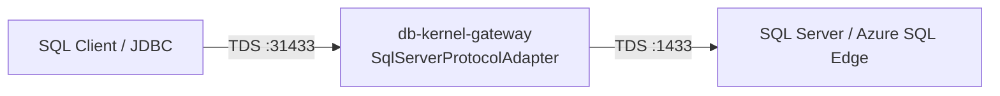

# SQL Server (TDS) 网关接入计划

> **决策**：第三协议为 **SQL Server / TDS**（非 Oracle）。  
> **分支**：`future/database-wire-protocol-foundation`  
> **状态**：P0 脚手架已落地（透明双工中继 + 注册表 + framing 单测）；见 [STATUS_AND_GAPS.md](STATUS_AND_GAPS.md) P2-7。

## 1. 目标

在现有协议无关基础设施上，提供 **透明 TDS 网关**：

| 复用能力 | 来源 |
|---|---|
| 后端连接池 | `PooledBackendProvider` + `gateway.pool.*` |
| 客户端 TLS 终止 | `ClientTlsTerminator` + `gateway.tls.*` |
| 多后端 failover / 路由 | `RoutingBackendProvider` + `gateway.routing.*` |
| Session reset SPI | `BackendSessionReset`（P0 为 `none()`；协议 reset 后续） |
| 适配器注册 | `ProtocolAdapterRegistry`：`sqlserver` / `mssql` |

**不**做完整 TDS 改写引擎；默认路径是字节透明转发（与早期 MySQL/PG 一致）。

## 2. 架构



ASCII：

```
  Client ──TDS──▶ Gateway:31433 ──TDS──▶ SQL Server:1433
                    │
                    ├─ pool / TLS terminate / routing（基类）
                    └─ DuplexRelay 透明双工（P0）
```

## 3. 阶段

### P0（本提交）— 透明中继 + 生命周期

- [x] `SqlServerProtocolAdapter` 继承 `AbstractProtocolAdapter`
- [x] 注册 `sqlserver` / `mssql`；`BackendSessionReset.none()`
- [x] 最小 TDS：`TdsFrameCodec` / `TdsMessageFraming`（8 字节头、BE length、EOM 拼逻辑消息）
- [x] accept 后双工透明转发（PreLogin/Login7 等由客户端与后端自行完成）
- [x] `application-sqlserver-template.yml`（proxy-port **31433** → target **1433**，密码占位 `change-me`）
- [x] 单测：registry、framing、adapter start/stop、透明中继

**说明**：TDS 虽为 client-first（PreLogin），但 PreLogin 不含 user/database；P0 `acquire` 使用空 `RoutingContext`（与 MySQL 首连类似）。Login7 观测留给 P1。

### P1 — 基础观测与冒烟

- [ ] 可解析时观测 Login7 用户 / 初始库（写入 `SqlServerSession` / 事件）
- [ ] 后端错误透传（默认已是 transparent；网关侧拒绝时可补最小 TDS ERROR token）
- [ ] 本机 Docker 集成冒烟（可选；无 Docker 时 skip）

### P2 — 深化（延期）

- [ ] 更深 TDS 消息类型（RPC、Attention/cancel、Bulk 等）
- [ ] 结果集脱敏 / 改写
- [ ] 协议级 `BackendSessionReset`（若有稳定 wire 语义）
- [ ] Login7 peek → `RoutingContext`（在不破坏透明认证的前提下）

## 4. 非目标

- 完整 TDS 协议重写 / 认证终结（网关代登）
- Oracle TNS（仍为 stub；本决策明确第三库为 SQL Server）
- 将生产 SA 密码提交进 git

## 5. 本地 Docker（冒烟）

| 项 | 建议 |
|---|---|
| 镜像 | `mcr.microsoft.com/mssql/server:2022-latest`（x86_64）；Apple Silicon 可用 `mcr.microsoft.com/azure-sql-edge` |
| 端口 | 宿主 `1433:1433` |
| EULA | `ACCEPT_EULA=Y` |
| SA 密码 | **本地实验室示例**：`Aa123456.`（与本机 MySQL/PG Docker 习惯一致，含末尾点号） |
| 复杂度 | SQL Server 策略要求大小写 + 数字 + 符号；若策略拒绝，可改 `Aa123456!` 并同步本地 `application-dev.yml`（仍勿提交） |

示例（**仅 OPS / 本地**，勿写入已提交的 template 生产密钥）：

```bash
docker run -d --name mssql-lab \
  -e 'ACCEPT_EULA=Y' \
  -e 'MSSQL_SA_PASSWORD=Aa123456.' \
  -p 1433:1433 \
  mcr.microsoft.com/mssql/server:2022-latest
```

Apple Silicon 备选：

```bash
docker run -d --name mssql-lab \
  -e 'ACCEPT_EULA=Y' \
  -e 'MSSQL_SA_PASSWORD=Aa123456.' \
  -p 1433:1433 \
  mcr.microsoft.com/azure-sql-edge
```

若 `Aa123456.` 被策略拒绝，改用 `Aa123456!` 并在本地配置中同步。

## 6. 跑通网关（对着本地 SQL Server）

```bash
cp src/main/resources/application-sqlserver-template.yml \
   src/main/resources/application-dev.yml
# 编辑 application-dev.yml：gateway.target.password=Aa123456. （gitignore，勿 commit）
mvn spring-boot:run -Dspring-boot.run.profiles=dev
```

客户端连 **`localhost:31433`**（网关），目标库 **`localhost:1433`**。

JDBC 示例 URL：`jdbc:sqlserver://localhost:31433;databaseName=master;encrypt=false;trustServerCertificate=true`

## 7. 验收

| 项 | 标准 |
|---|---|
| 单元 | framing / registry / adapter 中继；`mvn test` 全绿 |
| 集成 | Docker 可用时可选冒烟；默认 CI **不**要求 Docker |
| 配置 | template 仅 `change-me`；本地密码只出现在 OPS/本计划与 gitignore 的 dev yml |

## 8. 代码入口

| 路径 | 角色 |
|---|---|
| `SqlServerProtocolAdapter` | 监听 / 会话 / DuplexRelay |
| `adapter/sqlserver/TdsFrameCodec` | 8 字节头编解码 |
| `adapter/sqlserver/TdsMessageFraming` | EOM 逻辑消息边界 |
| `adapter/sqlserver/SqlServerSession` | 会话状态（P1 填身份） |
| `application-sqlserver-template.yml` | 配置模板 |
